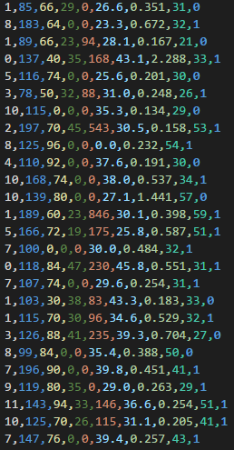

# K-Nearest Neighbors

- K-최근접 이웃 분류기

## K-최근접 이웃 알고리즘

- 패턴 인식에서, k-최근접 이웃 알고리즘(또는 줄여서 k-NN)은 분류나 회귀에 사용되는 비모수 방식이다. 두 경우 모두 입력이 특징 공간 내 k개의 가장 가까운 훈련 데이터로 구성되어 있다. 출력은 k-NN이 분류로 사용되었는지 또는 회귀로 사용되었는지에 따라 다르다.
	- k-NN 분류에서 출력은 소속된 항목이다. 객체는 k개의 최근접 이웃 사이에서 가장 공통적인 항목에 할당되는 객체로 과반수 의결에 의해 분류된다(k는 양의 정수이며 통상적으로 작은 수). 만약 k = 1 이라면 객체는 단순히 하나의 최근접 이웃의 항목에 할당된다.
	- k-NN 회귀에서 출력은 객체의 특성 값이다. 이 값은 k개의 최근접 이웃이 가진 값의 평균이다.

- k-NN은 함수가 오직 지역적으로 근사하고 모든 계산이 분류될 때까지 연기되는 인스턴스 기반 학습 또는 게으른 학습의 일종이다. k-NN 알고리즘은 가장 간단한 기계 학습 알고리즘에 속한다.

- 분류와 회귀 모두 더 가까운 이웃일수록 더 먼 이웃보다 평균에 더 많이 기여하도록 이웃의 기여에 가중치를 주는 것이 유용할 수 있다. 예를 들어, 가장 흔한 가중치 스키마는 d가 이웃까지의 거리일 때 각각의 이웃에게 1/d의 가중치를 주는 것이다.

- 이웃은 항목(k-NN 분류의 경우)이나 객체 특성 값(k-NN 회귀의 경우)이 알려진 객체의 집합으로부터 구해진다. 이것은 명시적인 훈련 과정이 필요하지는 않지만, 알고리즘을 위한 훈련 집합이라고 생각될 수 있다.

## KNN 분류기 구현 실습

### DataSet
- [Pima Indians Diabetes](https://www.kaggle.com/uciml/pima-indians-diabetes-database)
- 북미 원주민(인디언)의 한 부족인 **피마족 여성**에 대한 데이터셋으로 BMI, 나이 등의 8가지 변수와 당뇨병을 앓고 있는 지 여부(0 or 1)가 나타나 있습니다.

- 이 데이터셋은 다음과 같은 9개의 Parameter들로 이루어져 있습니다.
	- Number of times pregnant
	- Plasma glucose concentration a 2 hours in an oral glucose tolerance test
	- Diastolic blood pressure (mm Hg)
	- Triceps skin fold thickness (mm)
	- 2-Hour serum insulin (mu U/ml)
	- Body mass index (weight in kg/(height in m)^2)
	- Diabetes pedigree function
	- Age (years)
	- Class variable (0 or 1)

- 맨 끝번째인 9번째에는 0과 1로 당뇨병 여부(Class)를 나타냅니다.

### sklearn: KNN 실습

- [sklearn_KNN.ipynb](./sklearn_KNN.ipynb)
- [sklearn_KNN.html](./sklearn_KNN.html)

### 가중치를 활용한 KNN 구현 실습

- 실습에 필요한 파일들
	- [classifier_utils.py](./classifier_utils.py)
	- [data.csv](./data.csv)
	- 위 파일들이 동일한 폴더내에 있어야 합니다.
- [KNN.ipynb](./KNN.ipynb)
- [KNN.html](./KNN.html)