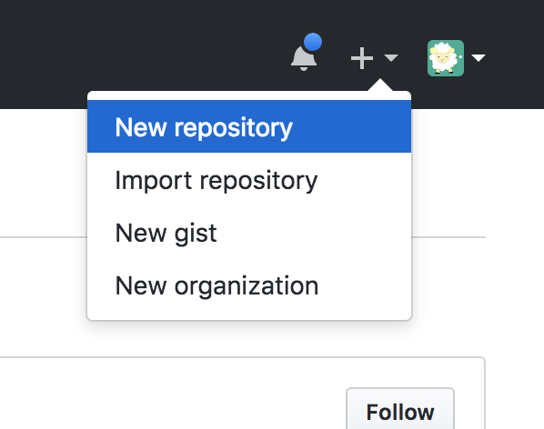
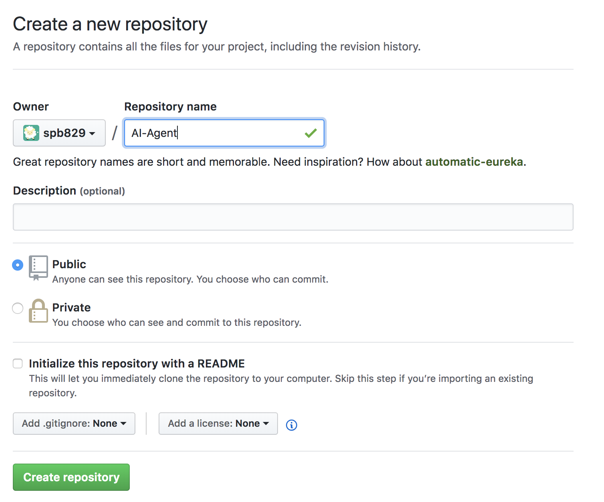
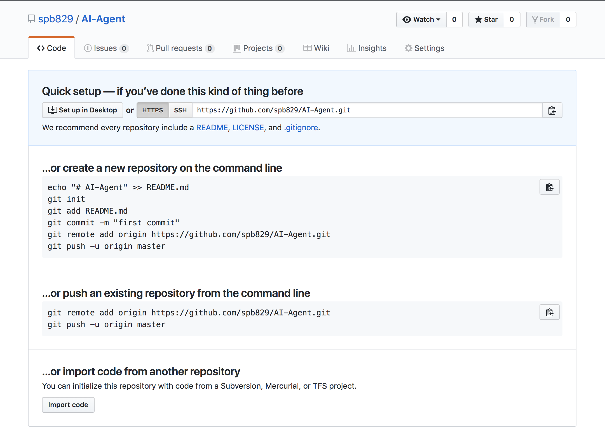
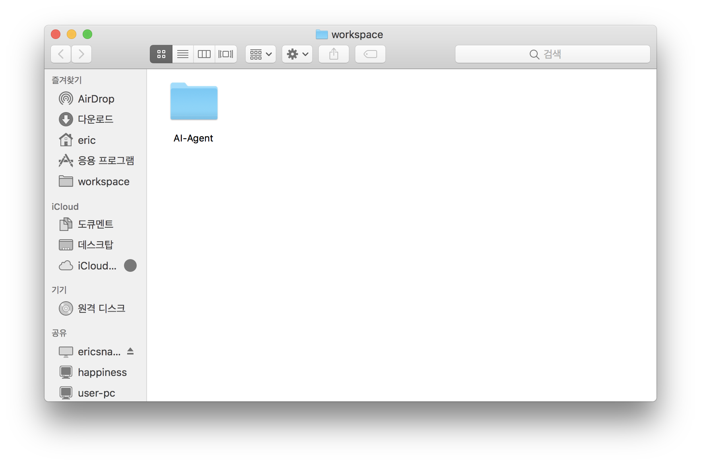
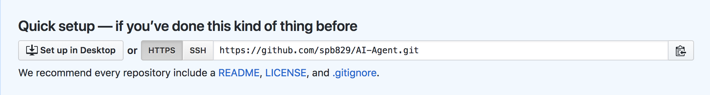
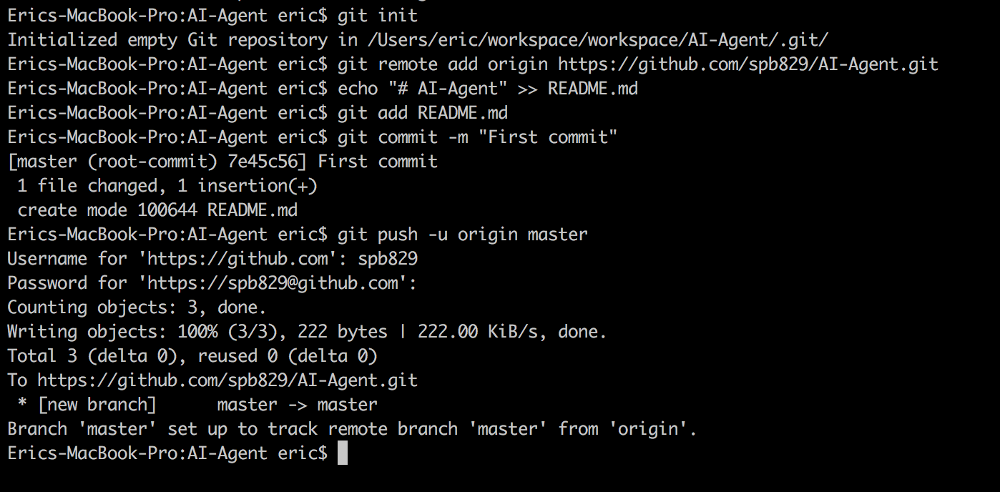
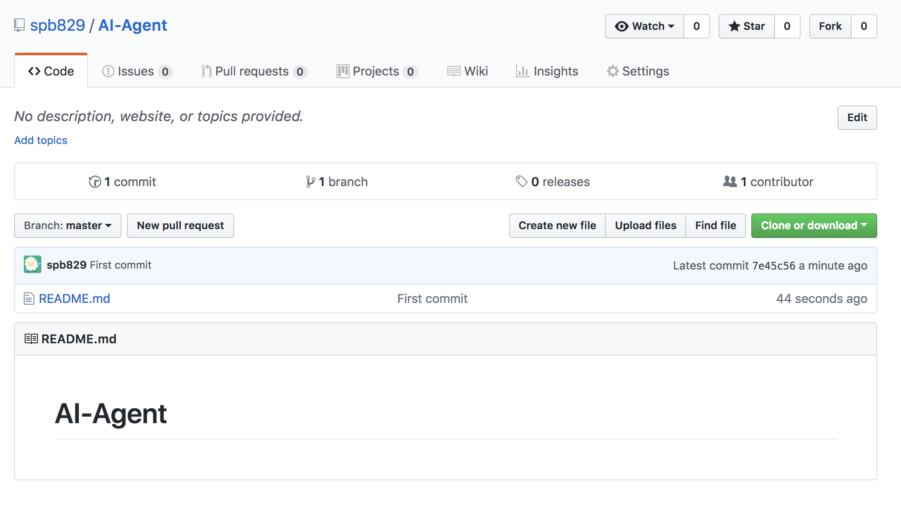

# 첫 Repository 만들기

## 실습

Github에 아직 가입하지 않으셨다면 가입을 하고 진행해주세요.

- [Github 가입 & 로그인](https://github.com/)

- [New Repository 클릭](https://github.com/new)



- 새로운 Repository의 제목을 설정해주세요. (그림에서는 AI-Agent라고 설정)



- 다음과 같은 화면이 나온다면 성공적으로 Repository를 생성한 것입니다.



- 이제 새로운 Repository에 파일을 추가할 수 있습니다.
- 먼저 이 Repository를 위한 폴더를 생성해주세요.



- 터미널 실행하고 해당 경로로 들어갑니다.

(예시)
```
cd ~/workspace/AI-Agent
```


- 간단히 git clone을 사용해서 시작할 수도 있지만 실습을 위해 remote 명령어를 사용합니다.

```
# Git 초기화
git init
```

- 본인에게 맞는 주소로 입력하셔야 합니다.



```
# origin이라는 이름의 remote 주소 설정
git remote add origin https://github.com/spb829/AI-Agent.git
```

- README.md에 "# AI-Agent"라는 문자열을 입력합니다.
    - README.md 파일이 없을 경우 자동으로 생성합니다.
    - Windows의 경우 작동되지 않을 수도 있습니다. 이럴 경우 에디터를 통해 직접 파일을 만들어주세요.

```
echo "# AI-Agent" >> README.md
```

- README.md 파일을 추가합니다.

```
git add README.md
```

- 추가된 해당 파일에 대해 Commit 메시지를 작성합니다.

```
git commit -m "First commit"
```

- 로컬에 있는 커밋들을 Repository(서버)로 Push해줍니다.
    - 초기에는 -u 옵션(upstream)이 사용됩니다.
    - 이후에는 편하게 **git push**만 입력해도 됩니다.
    - "origin" remote의 master 브랜치로 푸시한다는 뜻입니다.

```
git push -u origin master
```

- 아이디와 비밀번호를 물어볼 경우 입력해주세요.

- 결과화면



- push가 완료되었다면 해당 Repository 페이지를 확인합니다.



- 위와 같은 화면을 확인하셨다면 성공!

## 요약

- 명령어

```
git init
git remote add origin [본인의 Github Repository 주소]
echo "# AI-Agent" >> README.md
git add README.md
git commit -m "First commit"
git push -u origin master
```