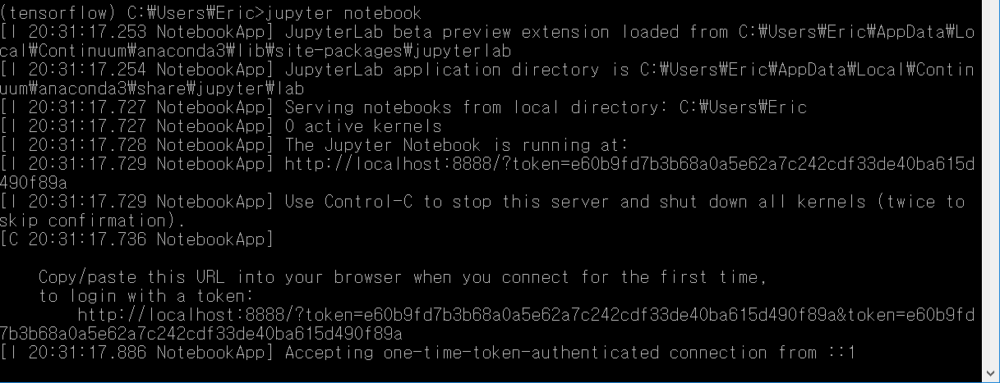
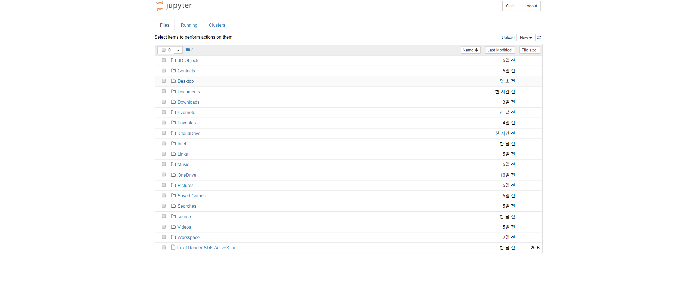
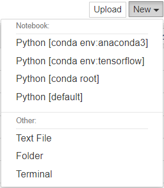
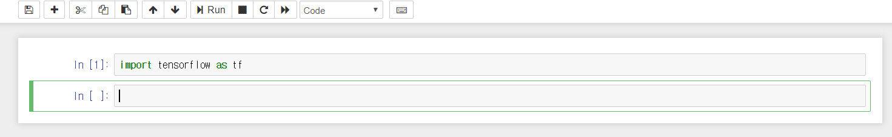
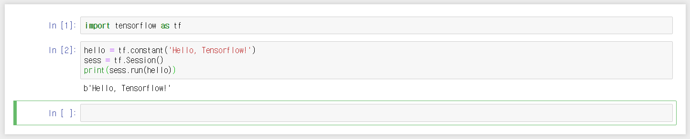
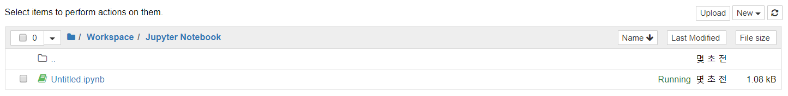
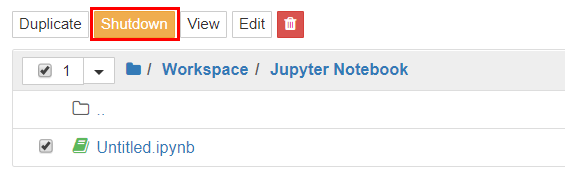

# Jupyter Notebook


## Jupyter Notebook 설치 및 실행

- pip을 통해 설치
```
pip install jupyter
```

- Anaconda 가상환경 지원을 위한 **nb_conda** 설치
```
conda install nb_conda
```

- 실행
```
jupyter notebook
```


- 다음과 같은 화면이 나온다면 잘 설치된 것입니다.


## Jupyter Notebook 사용방법

- New 버튼을 클릭하면 파일을 생성할 수 있는 메뉴가 나온다.



- Python [conda env:tensorflow]를 선택하여 새로운 Python3 파일을 만들어 봅니다.

- 'Untitled'라는 새로운 탭이 열리며 코드를 타이핑할 수 있는 박스가 생긴다.


- Tensorflow 테스트
```
import tensorflow as tf
```
- 위 코드를 입력하고 Run을 해보면 다음과 같은 화면이 나오게 된다.



- 만약 에러가 발생했다면, tensorflow가 제대로 설치되지 않은 가상환경에서 실행한 것이다.
- 다음 In 박스에 코드를 입력
```
hello = tf.constant('Hello, Tensorflow!')
sess = tf.Session()
print(sess.run(hello))
```
- Run을 하게 되면 다음과 같은 화면이 나온다.



- 그리고 이전에 열려있던 탭으로 가게되면 해당 ipynb파일이 Running으로 나오게 된다.



- 이 경우, 컴퓨터에 부담을 주게 되므로 작업이 끝난 파일에 대해서는 Shutdown 버튼을 눌러 꺼주는 것이 좋다.

