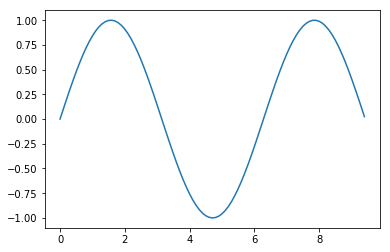
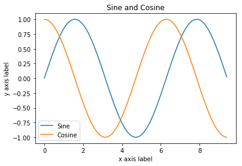
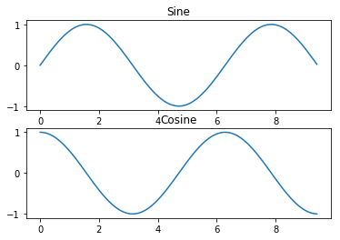
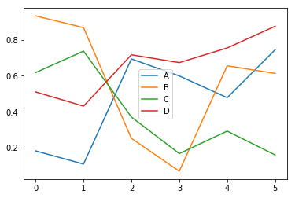
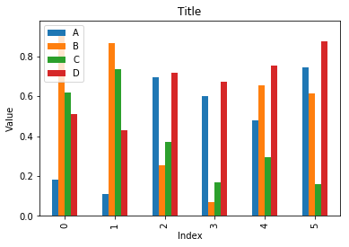

# Matplotlib

- [Jupyter Notebook 버전](./Matplotlib.ipynb)

# Matplotlib - pyplot


```python
import numpy as np
import matplotlib.pyplot as plt
import pandas as pd
%matplotlib inline
print("Load numpy & matplotlib")
```

    Load numpy & matplotlib
    


```python
# Compute the x and y coordinates for points on a sine curve
x = np.arange(0, 3 * np.pi, 0.1)
y = np.sin(x)

# Plot the points using matplotlib
plt.plot(x, y)
```


    [<matplotlib.lines.Line2D at 0x27f490e4a90>]





```python
y_sin = np.sin(x)
y_cos = np.cos(x)
# Plot the points using matplotlib
plt.plot(x, y_sin)
plt.plot(x, y_cos)
plt.xlabel('x axis label')
plt.ylabel('y axis label')
plt.title('Sine and Cosine')
plt.legend(['Sine', 'Cosine'])

# Show the figure.
plt.show()
```





```python
# Compute the x and y coordinates for points 
# on sine and cosine curves
x = np.arange(0, 3 * np.pi, 0.1)
y_sin = np.sin(x)
y_cos = np.cos(x)

# Set up a subplot grid that has height 2 and width 1,
# and set the first such subplot as active.
plt.subplot(2, 1, 1)

# Make the first plot
plt.plot(x, y_sin)
plt.title('Sine')

# Set the second subplot as active, and make the second plot.
plt.subplot(2, 1, 2)
plt.plot(x, y_cos)
plt.title('Cosine')

# Show the figure.
plt.show()
```





```python
df = pd.DataFrame(np.random.random((6,4)), columns=list('ABCD'))
print(df)
```

              A         B         C         D
    0  0.182403  0.932341  0.617658  0.510286
    1  0.109147  0.867219  0.736818  0.431215
    2  0.693341  0.252009  0.370657  0.716338
    3  0.599021  0.069447  0.167469  0.672942
    4  0.478174  0.655511  0.292501  0.754268
    5  0.744116  0.613191  0.160027  0.874583
    


```python
df.plot()
```


    <matplotlib.axes._subplots.AxesSubplot at 0x27f492a4668>





```python
df.plot(kind='bar')
plt.xlabel('Index')
plt.ylabel('Value')
plt.title('Title')

plt.show()
```




