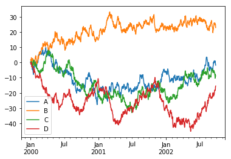
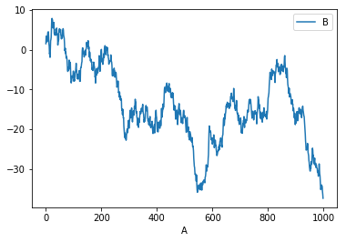

# Pandas

- [Jupyter Notebook 버전](./Pandas.ipynb)

# Load Packages


```python
import pandas as pd
import numpy as np
import matplotlib.pyplot as plt
print("Load Packages")
```

    Load Packages
    

# Object Creation


```python
s = pd.Series([1,3,5,np.nan,6,8])
print(s)
```

    0    1.0
    1    3.0
    2    5.0
    3    NaN
    4    6.0
    5    8.0
    dtype: float64
    


```python
dates = pd.date_range('20130101', periods=6)
print(dates)
```

    DatetimeIndex(['2013-01-01', '2013-01-02', '2013-01-03', '2013-01-04',
                   '2013-01-05', '2013-01-06'],
                  dtype='datetime64[ns]', freq='D')
    


```python
df = pd.DataFrame(np.random.randn(6,4), index=dates, columns=list('ABCD'))
print(df)
```

                       A         B         C         D
    2013-01-01  0.386437  0.631680 -1.566957  0.038252
    2013-01-02  2.587737 -0.513880 -0.032942 -0.077646
    2013-01-03  0.322899 -0.409107  0.064566 -0.469974
    2013-01-04  1.082806 -0.958745  0.676092  0.574391
    2013-01-05 -0.709678  1.740235 -0.845200 -1.413227
    2013-01-06 -0.016965  1.555024 -0.281395  1.278854
    


```python
df2 = pd.DataFrame({ 'A' : 1.,
                     'B' : pd.Timestamp('20130102'),
                     'C' : pd.Series(1,index=list(range(4)),dtype='float32'),
                     'D' : np.array([3] * 4,dtype='int32'),
                     'E' : pd.Categorical(["test","train","test","train"]),
                     'F' : 'foo' })
print(df2)
```

         A          B    C  D      E    F
    0  1.0 2013-01-02  1.0  3   test  foo
    1  1.0 2013-01-02  1.0  3  train  foo
    2  1.0 2013-01-02  1.0  3   test  foo
    3  1.0 2013-01-02  1.0  3  train  foo
    


```python
df2.dtypes
```


    A           float64
    B    datetime64[ns]
    C           float32
    D             int32
    E          category
    F            object
    dtype: object


# Viewing Data


```python
df.head()
```


<div>
<style scoped>
    .dataframe tbody tr th:only-of-type {
        vertical-align: middle;
    }

    .dataframe tbody tr th {
        vertical-align: top;
    }

    .dataframe thead th {
        text-align: right;
    }
</style>
<table border="1" class="dataframe">
  <thead>
    <tr style="text-align: right;">
      <th></th>
      <th>A</th>
      <th>B</th>
      <th>C</th>
      <th>D</th>
    </tr>
  </thead>
  <tbody>
    <tr>
      <th>2013-01-01</th>
      <td>0.386437</td>
      <td>0.631680</td>
      <td>-1.566957</td>
      <td>0.038252</td>
    </tr>
    <tr>
      <th>2013-01-02</th>
      <td>2.587737</td>
      <td>-0.513880</td>
      <td>-0.032942</td>
      <td>-0.077646</td>
    </tr>
    <tr>
      <th>2013-01-03</th>
      <td>0.322899</td>
      <td>-0.409107</td>
      <td>0.064566</td>
      <td>-0.469974</td>
    </tr>
    <tr>
      <th>2013-01-04</th>
      <td>1.082806</td>
      <td>-0.958745</td>
      <td>0.676092</td>
      <td>0.574391</td>
    </tr>
    <tr>
      <th>2013-01-05</th>
      <td>-0.709678</td>
      <td>1.740235</td>
      <td>-0.845200</td>
      <td>-1.413227</td>
    </tr>
  </tbody>
</table>
</div>


```python
df.tail(3)
```


<div>
<style scoped>
    .dataframe tbody tr th:only-of-type {
        vertical-align: middle;
    }

    .dataframe tbody tr th {
        vertical-align: top;
    }

    .dataframe thead th {
        text-align: right;
    }
</style>
<table border="1" class="dataframe">
  <thead>
    <tr style="text-align: right;">
      <th></th>
      <th>A</th>
      <th>B</th>
      <th>C</th>
      <th>D</th>
    </tr>
  </thead>
  <tbody>
    <tr>
      <th>2013-01-04</th>
      <td>1.082806</td>
      <td>-0.958745</td>
      <td>0.676092</td>
      <td>0.574391</td>
    </tr>
    <tr>
      <th>2013-01-05</th>
      <td>-0.709678</td>
      <td>1.740235</td>
      <td>-0.845200</td>
      <td>-1.413227</td>
    </tr>
    <tr>
      <th>2013-01-06</th>
      <td>-0.016965</td>
      <td>1.555024</td>
      <td>-0.281395</td>
      <td>1.278854</td>
    </tr>
  </tbody>
</table>
</div>


```python
df.index
```


    DatetimeIndex(['2013-01-01', '2013-01-02', '2013-01-03', '2013-01-04',
                   '2013-01-05', '2013-01-06'],
                  dtype='datetime64[ns]', freq='D')


```python
df.columns
```


    Index(['A', 'B', 'C', 'D'], dtype='object')


```python
df.values
```


    array([[ 0.38643655,  0.63168027, -1.56695658,  0.03825192],
           [ 2.58773732, -0.51388006, -0.03294232, -0.07764577],
           [ 0.32289943, -0.40910699,  0.06456588, -0.46997417],
           [ 1.08280633, -0.9587452 ,  0.67609179,  0.57439145],
           [-0.70967831,  1.74023513, -0.84519998, -1.41322671],
           [-0.01696452,  1.55502441, -0.28139453,  1.27885395]])


```python
df.describe()
```


<div>
<style scoped>
    .dataframe tbody tr th:only-of-type {
        vertical-align: middle;
    }

    .dataframe tbody tr th {
        vertical-align: top;
    }

    .dataframe thead th {
        text-align: right;
    }
</style>
<table border="1" class="dataframe">
  <thead>
    <tr style="text-align: right;">
      <th></th>
      <th>A</th>
      <th>B</th>
      <th>C</th>
      <th>D</th>
    </tr>
  </thead>
  <tbody>
    <tr>
      <th>count</th>
      <td>6.000000</td>
      <td>6.000000</td>
      <td>6.000000</td>
      <td>6.000000</td>
    </tr>
    <tr>
      <th>mean</th>
      <td>0.608873</td>
      <td>0.340868</td>
      <td>-0.330973</td>
      <td>-0.011558</td>
    </tr>
    <tr>
      <th>std</th>
      <td>1.131550</td>
      <td>1.140090</td>
      <td>0.781536</td>
      <td>0.915442</td>
    </tr>
    <tr>
      <th>min</th>
      <td>-0.709678</td>
      <td>-0.958745</td>
      <td>-1.566957</td>
      <td>-1.413227</td>
    </tr>
    <tr>
      <th>25%</th>
      <td>0.068001</td>
      <td>-0.487687</td>
      <td>-0.704249</td>
      <td>-0.371892</td>
    </tr>
    <tr>
      <th>50%</th>
      <td>0.354668</td>
      <td>0.111287</td>
      <td>-0.157168</td>
      <td>-0.019697</td>
    </tr>
    <tr>
      <th>75%</th>
      <td>0.908714</td>
      <td>1.324188</td>
      <td>0.040189</td>
      <td>0.440357</td>
    </tr>
    <tr>
      <th>max</th>
      <td>2.587737</td>
      <td>1.740235</td>
      <td>0.676092</td>
      <td>1.278854</td>
    </tr>
  </tbody>
</table>
</div>


```python
df.sort_values(by='B')
```


<div>
<style scoped>
    .dataframe tbody tr th:only-of-type {
        vertical-align: middle;
    }

    .dataframe tbody tr th {
        vertical-align: top;
    }

    .dataframe thead th {
        text-align: right;
    }
</style>
<table border="1" class="dataframe">
  <thead>
    <tr style="text-align: right;">
      <th></th>
      <th>A</th>
      <th>B</th>
      <th>C</th>
      <th>D</th>
    </tr>
  </thead>
  <tbody>
    <tr>
      <th>2013-01-04</th>
      <td>1.082806</td>
      <td>-0.958745</td>
      <td>0.676092</td>
      <td>0.574391</td>
    </tr>
    <tr>
      <th>2013-01-02</th>
      <td>2.587737</td>
      <td>-0.513880</td>
      <td>-0.032942</td>
      <td>-0.077646</td>
    </tr>
    <tr>
      <th>2013-01-03</th>
      <td>0.322899</td>
      <td>-0.409107</td>
      <td>0.064566</td>
      <td>-0.469974</td>
    </tr>
    <tr>
      <th>2013-01-01</th>
      <td>0.386437</td>
      <td>0.631680</td>
      <td>-1.566957</td>
      <td>0.038252</td>
    </tr>
    <tr>
      <th>2013-01-06</th>
      <td>-0.016965</td>
      <td>1.555024</td>
      <td>-0.281395</td>
      <td>1.278854</td>
    </tr>
    <tr>
      <th>2013-01-05</th>
      <td>-0.709678</td>
      <td>1.740235</td>
      <td>-0.845200</td>
      <td>-1.413227</td>
    </tr>
  </tbody>
</table>
</div>


```python
df.sort_values(by='B', ascending=False)
```


<div>
<style scoped>
    .dataframe tbody tr th:only-of-type {
        vertical-align: middle;
    }

    .dataframe tbody tr th {
        vertical-align: top;
    }

    .dataframe thead th {
        text-align: right;
    }
</style>
<table border="1" class="dataframe">
  <thead>
    <tr style="text-align: right;">
      <th></th>
      <th>A</th>
      <th>B</th>
      <th>C</th>
      <th>D</th>
    </tr>
  </thead>
  <tbody>
    <tr>
      <th>2013-01-05</th>
      <td>-0.709678</td>
      <td>1.740235</td>
      <td>-0.845200</td>
      <td>-1.413227</td>
    </tr>
    <tr>
      <th>2013-01-06</th>
      <td>-0.016965</td>
      <td>1.555024</td>
      <td>-0.281395</td>
      <td>1.278854</td>
    </tr>
    <tr>
      <th>2013-01-01</th>
      <td>0.386437</td>
      <td>0.631680</td>
      <td>-1.566957</td>
      <td>0.038252</td>
    </tr>
    <tr>
      <th>2013-01-03</th>
      <td>0.322899</td>
      <td>-0.409107</td>
      <td>0.064566</td>
      <td>-0.469974</td>
    </tr>
    <tr>
      <th>2013-01-02</th>
      <td>2.587737</td>
      <td>-0.513880</td>
      <td>-0.032942</td>
      <td>-0.077646</td>
    </tr>
    <tr>
      <th>2013-01-04</th>
      <td>1.082806</td>
      <td>-0.958745</td>
      <td>0.676092</td>
      <td>0.574391</td>
    </tr>
  </tbody>
</table>
</div>


# Import csv dataset


```python
url = 'https://raw.githubusercontent.com/spb829/AI-Agent/practice3/Packages/Pandas/sample_data.csv'
dataset = pd.read_csv(url)
dataset.head()
```


<div>
<style scoped>
    .dataframe tbody tr th:only-of-type {
        vertical-align: middle;
    }

    .dataframe tbody tr th {
        vertical-align: top;
    }

    .dataframe thead th {
        text-align: right;
    }
</style>
<table border="1" class="dataframe">
  <thead>
    <tr style="text-align: right;">
      <th></th>
      <th>InvoiceNo</th>
      <th>StockCode</th>
      <th>Description</th>
      <th>Quantity</th>
      <th>InvoiceDate</th>
      <th>UnitPrice</th>
      <th>CustomerID</th>
      <th>Country</th>
    </tr>
  </thead>
  <tbody>
    <tr>
      <th>0</th>
      <td>536365</td>
      <td>85123A</td>
      <td>WHITE HANGING HEART T-LIGHT HOLDER</td>
      <td>6</td>
      <td>12/1/10 8:26</td>
      <td>2.55</td>
      <td>17850</td>
      <td>United Kingdom</td>
    </tr>
    <tr>
      <th>1</th>
      <td>536365</td>
      <td>71053</td>
      <td>WHITE METAL LANTERN</td>
      <td>6</td>
      <td>12/1/10 8:26</td>
      <td>3.39</td>
      <td>17850</td>
      <td>United Kingdom</td>
    </tr>
    <tr>
      <th>2</th>
      <td>536365</td>
      <td>84406B</td>
      <td>CREAM CUPID HEARTS COAT HANGER</td>
      <td>8</td>
      <td>12/1/10 8:26</td>
      <td>2.75</td>
      <td>17850</td>
      <td>United Kingdom</td>
    </tr>
    <tr>
      <th>3</th>
      <td>536365</td>
      <td>84029G</td>
      <td>KNITTED UNION FLAG HOT WATER BOTTLE</td>
      <td>6</td>
      <td>12/1/10 8:26</td>
      <td>3.39</td>
      <td>17850</td>
      <td>United Kingdom</td>
    </tr>
    <tr>
      <th>4</th>
      <td>536365</td>
      <td>84029E</td>
      <td>RED WOOLLY HOTTIE WHITE HEART.</td>
      <td>6</td>
      <td>12/1/10 8:26</td>
      <td>3.39</td>
      <td>17850</td>
      <td>United Kingdom</td>
    </tr>
  </tbody>
</table>
</div>


# Selecting a single column


```python
df['A']
```


    2013-01-01    0.386437
    2013-01-02    2.587737
    2013-01-03    0.322899
    2013-01-04    1.082806
    2013-01-05   -0.709678
    2013-01-06   -0.016965
    Freq: D, Name: A, dtype: float64


# Selection by Label


```python
df.loc[dates[0]]
```


    A    0.386437
    B    0.631680
    C   -1.566957
    D    0.038252
    Name: 2013-01-01 00:00:00, dtype: float64


```python
df.loc[:,['A','B']]
```


<div>
<style scoped>
    .dataframe tbody tr th:only-of-type {
        vertical-align: middle;
    }

    .dataframe tbody tr th {
        vertical-align: top;
    }

    .dataframe thead th {
        text-align: right;
    }
</style>
<table border="1" class="dataframe">
  <thead>
    <tr style="text-align: right;">
      <th></th>
      <th>A</th>
      <th>B</th>
    </tr>
  </thead>
  <tbody>
    <tr>
      <th>2013-01-01</th>
      <td>0.386437</td>
      <td>0.631680</td>
    </tr>
    <tr>
      <th>2013-01-02</th>
      <td>2.587737</td>
      <td>-0.513880</td>
    </tr>
    <tr>
      <th>2013-01-03</th>
      <td>0.322899</td>
      <td>-0.409107</td>
    </tr>
    <tr>
      <th>2013-01-04</th>
      <td>1.082806</td>
      <td>-0.958745</td>
    </tr>
    <tr>
      <th>2013-01-05</th>
      <td>-0.709678</td>
      <td>1.740235</td>
    </tr>
    <tr>
      <th>2013-01-06</th>
      <td>-0.016965</td>
      <td>1.555024</td>
    </tr>
  </tbody>
</table>
</div>


```python
df.loc['20130102':'20130104',['A','B']]
```


<div>
<style scoped>
    .dataframe tbody tr th:only-of-type {
        vertical-align: middle;
    }

    .dataframe tbody tr th {
        vertical-align: top;
    }

    .dataframe thead th {
        text-align: right;
    }
</style>
<table border="1" class="dataframe">
  <thead>
    <tr style="text-align: right;">
      <th></th>
      <th>A</th>
      <th>B</th>
    </tr>
  </thead>
  <tbody>
    <tr>
      <th>2013-01-02</th>
      <td>2.587737</td>
      <td>-0.513880</td>
    </tr>
    <tr>
      <th>2013-01-03</th>
      <td>0.322899</td>
      <td>-0.409107</td>
    </tr>
    <tr>
      <th>2013-01-04</th>
      <td>1.082806</td>
      <td>-0.958745</td>
    </tr>
  </tbody>
</table>
</div>


```python
df.loc['20130102',['A','B']]
```


    A    2.587737
    B   -0.513880
    Name: 2013-01-02 00:00:00, dtype: float64


# Selection by Position


```python
df.iloc[3]
```


    A    1.082806
    B   -0.958745
    C    0.676092
    D    0.574391
    Name: 2013-01-04 00:00:00, dtype: float64


```python
df.iloc[3:5,0:2]
```


<div>
<style scoped>
    .dataframe tbody tr th:only-of-type {
        vertical-align: middle;
    }

    .dataframe tbody tr th {
        vertical-align: top;
    }

    .dataframe thead th {
        text-align: right;
    }
</style>
<table border="1" class="dataframe">
  <thead>
    <tr style="text-align: right;">
      <th></th>
      <th>A</th>
      <th>B</th>
    </tr>
  </thead>
  <tbody>
    <tr>
      <th>2013-01-04</th>
      <td>1.082806</td>
      <td>-0.958745</td>
    </tr>
    <tr>
      <th>2013-01-05</th>
      <td>-0.709678</td>
      <td>1.740235</td>
    </tr>
  </tbody>
</table>
</div>


```python
df.iloc[[1,2,4],[0,2]]
```


<div>
<style scoped>
    .dataframe tbody tr th:only-of-type {
        vertical-align: middle;
    }

    .dataframe tbody tr th {
        vertical-align: top;
    }

    .dataframe thead th {
        text-align: right;
    }
</style>
<table border="1" class="dataframe">
  <thead>
    <tr style="text-align: right;">
      <th></th>
      <th>A</th>
      <th>C</th>
    </tr>
  </thead>
  <tbody>
    <tr>
      <th>2013-01-02</th>
      <td>2.587737</td>
      <td>-0.032942</td>
    </tr>
    <tr>
      <th>2013-01-03</th>
      <td>0.322899</td>
      <td>0.064566</td>
    </tr>
    <tr>
      <th>2013-01-05</th>
      <td>-0.709678</td>
      <td>-0.845200</td>
    </tr>
  </tbody>
</table>
</div>


# Setting

## Setting values by label


```python
df.at[dates[0],'A'] = 0
```

## Setting values by position


```python
df.iat[0,1] = 0
```

## Setting by assigning with a NumPy array


```python
df.loc[:,'D'] = np.array([5] * len(df))
```


```python
print(df)
```

                       A         B         C  D
    2013-01-01  0.000000  0.000000 -1.566957  5
    2013-01-02  2.587737 -0.513880 -0.032942  5
    2013-01-03  0.322899 -0.409107  0.064566  5
    2013-01-04  1.082806 -0.958745  0.676092  5
    2013-01-05 -0.709678  1.740235 -0.845200  5
    2013-01-06 -0.016965  1.555024 -0.281395  5
    

# Operations


```python
df.mean()
```


    A    0.544467
    B    0.235588
    C   -0.330973
    D    5.000000
    dtype: float64


```python
df.mean(1)
```


    2013-01-01    0.858261
    2013-01-02    1.760229
    2013-01-03    1.244590
    2013-01-04    1.450038
    2013-01-05    1.296339
    2013-01-06    1.564166
    Freq: D, dtype: float64


# Merge

## Concat


```python
df = pd.DataFrame(np.random.randn(10, 4))
```


```python
print(df)
```

              0         1         2         3
    0 -0.480403 -1.874805 -0.690456  0.833180
    1 -0.099077  0.083932  0.325588 -1.026590
    2  0.805814  1.190039 -1.124965 -0.215527
    3  1.653753  0.255412  2.063921 -0.205428
    4  0.231283 -0.441330  1.047225  1.799886
    5 -0.641299 -0.896167  0.922518  0.645659
    6  1.059639  0.327477  1.862763  0.546267
    7 -0.326032  0.812231 -0.758730 -0.239036
    8 -0.103092  0.530515 -0.875448 -1.873295
    9  0.651633  1.274894  0.800174  0.336762
    

### Break it into pieces


```python
pieces = [df[:3], df[3:7], df[7:]]
```

### Concatenate


```python
pd.concat(pieces)
```


<div>
<style scoped>
    .dataframe tbody tr th:only-of-type {
        vertical-align: middle;
    }

    .dataframe tbody tr th {
        vertical-align: top;
    }

    .dataframe thead th {
        text-align: right;
    }
</style>
<table border="1" class="dataframe">
  <thead>
    <tr style="text-align: right;">
      <th></th>
      <th>0</th>
      <th>1</th>
      <th>2</th>
      <th>3</th>
    </tr>
  </thead>
  <tbody>
    <tr>
      <th>0</th>
      <td>-0.480403</td>
      <td>-1.874805</td>
      <td>-0.690456</td>
      <td>0.833180</td>
    </tr>
    <tr>
      <th>1</th>
      <td>-0.099077</td>
      <td>0.083932</td>
      <td>0.325588</td>
      <td>-1.026590</td>
    </tr>
    <tr>
      <th>2</th>
      <td>0.805814</td>
      <td>1.190039</td>
      <td>-1.124965</td>
      <td>-0.215527</td>
    </tr>
    <tr>
      <th>3</th>
      <td>1.653753</td>
      <td>0.255412</td>
      <td>2.063921</td>
      <td>-0.205428</td>
    </tr>
    <tr>
      <th>4</th>
      <td>0.231283</td>
      <td>-0.441330</td>
      <td>1.047225</td>
      <td>1.799886</td>
    </tr>
    <tr>
      <th>5</th>
      <td>-0.641299</td>
      <td>-0.896167</td>
      <td>0.922518</td>
      <td>0.645659</td>
    </tr>
    <tr>
      <th>6</th>
      <td>1.059639</td>
      <td>0.327477</td>
      <td>1.862763</td>
      <td>0.546267</td>
    </tr>
    <tr>
      <th>7</th>
      <td>-0.326032</td>
      <td>0.812231</td>
      <td>-0.758730</td>
      <td>-0.239036</td>
    </tr>
    <tr>
      <th>8</th>
      <td>-0.103092</td>
      <td>0.530515</td>
      <td>-0.875448</td>
      <td>-1.873295</td>
    </tr>
    <tr>
      <th>9</th>
      <td>0.651633</td>
      <td>1.274894</td>
      <td>0.800174</td>
      <td>0.336762</td>
    </tr>
  </tbody>
</table>
</div>


## Join


```python
left = pd.DataFrame({'key': ['foo', 'foo'], 'lval': [1, 2]})
```


```python
right = pd.DataFrame({'key': ['foo', 'foo'], 'rval': [4, 5]})
```


```python
left
```


<div>
<style scoped>
    .dataframe tbody tr th:only-of-type {
        vertical-align: middle;
    }

    .dataframe tbody tr th {
        vertical-align: top;
    }

    .dataframe thead th {
        text-align: right;
    }
</style>
<table border="1" class="dataframe">
  <thead>
    <tr style="text-align: right;">
      <th></th>
      <th>key</th>
      <th>lval</th>
    </tr>
  </thead>
  <tbody>
    <tr>
      <th>0</th>
      <td>foo</td>
      <td>1</td>
    </tr>
    <tr>
      <th>1</th>
      <td>foo</td>
      <td>2</td>
    </tr>
  </tbody>
</table>
</div>


```python
right
```


<div>
<style scoped>
    .dataframe tbody tr th:only-of-type {
        vertical-align: middle;
    }

    .dataframe tbody tr th {
        vertical-align: top;
    }

    .dataframe thead th {
        text-align: right;
    }
</style>
<table border="1" class="dataframe">
  <thead>
    <tr style="text-align: right;">
      <th></th>
      <th>key</th>
      <th>rval</th>
    </tr>
  </thead>
  <tbody>
    <tr>
      <th>0</th>
      <td>foo</td>
      <td>4</td>
    </tr>
    <tr>
      <th>1</th>
      <td>foo</td>
      <td>5</td>
    </tr>
  </tbody>
</table>
</div>


```python
pd.merge(left, right, on='key')
```


<div>
<style scoped>
    .dataframe tbody tr th:only-of-type {
        vertical-align: middle;
    }

    .dataframe tbody tr th {
        vertical-align: top;
    }

    .dataframe thead th {
        text-align: right;
    }
</style>
<table border="1" class="dataframe">
  <thead>
    <tr style="text-align: right;">
      <th></th>
      <th>key</th>
      <th>lval</th>
      <th>rval</th>
    </tr>
  </thead>
  <tbody>
    <tr>
      <th>0</th>
      <td>foo</td>
      <td>1</td>
      <td>4</td>
    </tr>
    <tr>
      <th>1</th>
      <td>foo</td>
      <td>1</td>
      <td>5</td>
    </tr>
    <tr>
      <th>2</th>
      <td>foo</td>
      <td>2</td>
      <td>4</td>
    </tr>
    <tr>
      <th>3</th>
      <td>foo</td>
      <td>2</td>
      <td>5</td>
    </tr>
  </tbody>
</table>
</div>


## Append


```python
df = pd.DataFrame(np.random.randn(8, 4), columns=['A','B','C','D'])
```


```python
df
```


<div>
<style scoped>
    .dataframe tbody tr th:only-of-type {
        vertical-align: middle;
    }

    .dataframe tbody tr th {
        vertical-align: top;
    }

    .dataframe thead th {
        text-align: right;
    }
</style>
<table border="1" class="dataframe">
  <thead>
    <tr style="text-align: right;">
      <th></th>
      <th>A</th>
      <th>B</th>
      <th>C</th>
      <th>D</th>
    </tr>
  </thead>
  <tbody>
    <tr>
      <th>0</th>
      <td>1.692754</td>
      <td>0.188717</td>
      <td>1.493358</td>
      <td>0.172429</td>
    </tr>
    <tr>
      <th>1</th>
      <td>1.513934</td>
      <td>-0.436352</td>
      <td>-0.615795</td>
      <td>0.189981</td>
    </tr>
    <tr>
      <th>2</th>
      <td>-0.487247</td>
      <td>-0.749732</td>
      <td>-0.487334</td>
      <td>0.193552</td>
    </tr>
    <tr>
      <th>3</th>
      <td>-1.771495</td>
      <td>0.476709</td>
      <td>-0.903206</td>
      <td>-1.030246</td>
    </tr>
    <tr>
      <th>4</th>
      <td>-0.030803</td>
      <td>-0.011199</td>
      <td>-0.641289</td>
      <td>-0.747393</td>
    </tr>
    <tr>
      <th>5</th>
      <td>-0.426773</td>
      <td>-0.201809</td>
      <td>0.561989</td>
      <td>-1.449375</td>
    </tr>
    <tr>
      <th>6</th>
      <td>0.741314</td>
      <td>0.897124</td>
      <td>0.033764</td>
      <td>-0.876354</td>
    </tr>
    <tr>
      <th>7</th>
      <td>-1.900430</td>
      <td>-0.491322</td>
      <td>-0.183983</td>
      <td>1.333700</td>
    </tr>
  </tbody>
</table>
</div>


```python
s = df.iloc[3]
```


```python
df.append(s, ignore_index=True)
```


<div>
<style scoped>
    .dataframe tbody tr th:only-of-type {
        vertical-align: middle;
    }

    .dataframe tbody tr th {
        vertical-align: top;
    }

    .dataframe thead th {
        text-align: right;
    }
</style>
<table border="1" class="dataframe">
  <thead>
    <tr style="text-align: right;">
      <th></th>
      <th>A</th>
      <th>B</th>
      <th>C</th>
      <th>D</th>
    </tr>
  </thead>
  <tbody>
    <tr>
      <th>0</th>
      <td>1.692754</td>
      <td>0.188717</td>
      <td>1.493358</td>
      <td>0.172429</td>
    </tr>
    <tr>
      <th>1</th>
      <td>1.513934</td>
      <td>-0.436352</td>
      <td>-0.615795</td>
      <td>0.189981</td>
    </tr>
    <tr>
      <th>2</th>
      <td>-0.487247</td>
      <td>-0.749732</td>
      <td>-0.487334</td>
      <td>0.193552</td>
    </tr>
    <tr>
      <th>3</th>
      <td>-1.771495</td>
      <td>0.476709</td>
      <td>-0.903206</td>
      <td>-1.030246</td>
    </tr>
    <tr>
      <th>4</th>
      <td>-0.030803</td>
      <td>-0.011199</td>
      <td>-0.641289</td>
      <td>-0.747393</td>
    </tr>
    <tr>
      <th>5</th>
      <td>-0.426773</td>
      <td>-0.201809</td>
      <td>0.561989</td>
      <td>-1.449375</td>
    </tr>
    <tr>
      <th>6</th>
      <td>0.741314</td>
      <td>0.897124</td>
      <td>0.033764</td>
      <td>-0.876354</td>
    </tr>
    <tr>
      <th>7</th>
      <td>-1.900430</td>
      <td>-0.491322</td>
      <td>-0.183983</td>
      <td>1.333700</td>
    </tr>
    <tr>
      <th>8</th>
      <td>-1.771495</td>
      <td>0.476709</td>
      <td>-0.903206</td>
      <td>-1.030246</td>
    </tr>
  </tbody>
</table>
</div>


## Grouping


```python
df = pd.DataFrame({'A' : ['foo', 'bar', 'foo', 'bar',
                          'foo', 'bar', 'foo', 'foo'],
                   'B' : ['one', 'one', 'two', 'three',
                          'two', 'two', 'one', 'three'],
                   'C' : np.random.randn(8),
                   'D' : np.random.randn(8)})
```


```python
df
```


<div>
<style scoped>
    .dataframe tbody tr th:only-of-type {
        vertical-align: middle;
    }

    .dataframe tbody tr th {
        vertical-align: top;
    }

    .dataframe thead th {
        text-align: right;
    }
</style>
<table border="1" class="dataframe">
  <thead>
    <tr style="text-align: right;">
      <th></th>
      <th>A</th>
      <th>B</th>
      <th>C</th>
      <th>D</th>
    </tr>
  </thead>
  <tbody>
    <tr>
      <th>0</th>
      <td>foo</td>
      <td>one</td>
      <td>0.040419</td>
      <td>0.144271</td>
    </tr>
    <tr>
      <th>1</th>
      <td>bar</td>
      <td>one</td>
      <td>1.049702</td>
      <td>0.025593</td>
    </tr>
    <tr>
      <th>2</th>
      <td>foo</td>
      <td>two</td>
      <td>-0.160966</td>
      <td>0.200839</td>
    </tr>
    <tr>
      <th>3</th>
      <td>bar</td>
      <td>three</td>
      <td>-0.447970</td>
      <td>-1.511027</td>
    </tr>
    <tr>
      <th>4</th>
      <td>foo</td>
      <td>two</td>
      <td>-0.518170</td>
      <td>-1.186448</td>
    </tr>
    <tr>
      <th>5</th>
      <td>bar</td>
      <td>two</td>
      <td>-1.079132</td>
      <td>-2.083422</td>
    </tr>
    <tr>
      <th>6</th>
      <td>foo</td>
      <td>one</td>
      <td>1.978252</td>
      <td>-0.331828</td>
    </tr>
    <tr>
      <th>7</th>
      <td>foo</td>
      <td>three</td>
      <td>0.442179</td>
      <td>-0.279596</td>
    </tr>
  </tbody>
</table>
</div>


```python
df.groupby('A').sum()
```


<div>
<style scoped>
    .dataframe tbody tr th:only-of-type {
        vertical-align: middle;
    }

    .dataframe tbody tr th {
        vertical-align: top;
    }

    .dataframe thead th {
        text-align: right;
    }
</style>
<table border="1" class="dataframe">
  <thead>
    <tr style="text-align: right;">
      <th></th>
      <th>C</th>
      <th>D</th>
    </tr>
    <tr>
      <th>A</th>
      <th></th>
      <th></th>
    </tr>
  </thead>
  <tbody>
    <tr>
      <th>bar</th>
      <td>-0.477401</td>
      <td>-3.568856</td>
    </tr>
    <tr>
      <th>foo</th>
      <td>1.781713</td>
      <td>-1.452762</td>
    </tr>
  </tbody>
</table>
</div>


```python
df.groupby(['A','B']).sum()
```


<div>
<style scoped>
    .dataframe tbody tr th:only-of-type {
        vertical-align: middle;
    }

    .dataframe tbody tr th {
        vertical-align: top;
    }

    .dataframe thead th {
        text-align: right;
    }
</style>
<table border="1" class="dataframe">
  <thead>
    <tr style="text-align: right;">
      <th></th>
      <th></th>
      <th>C</th>
      <th>D</th>
    </tr>
    <tr>
      <th>A</th>
      <th>B</th>
      <th></th>
      <th></th>
    </tr>
  </thead>
  <tbody>
    <tr>
      <th rowspan="3" valign="top">bar</th>
      <th>one</th>
      <td>1.049702</td>
      <td>0.025593</td>
    </tr>
    <tr>
      <th>three</th>
      <td>-0.447970</td>
      <td>-1.511027</td>
    </tr>
    <tr>
      <th>two</th>
      <td>-1.079132</td>
      <td>-2.083422</td>
    </tr>
    <tr>
      <th rowspan="3" valign="top">foo</th>
      <th>one</th>
      <td>2.018671</td>
      <td>-0.187557</td>
    </tr>
    <tr>
      <th>three</th>
      <td>0.442179</td>
      <td>-0.279596</td>
    </tr>
    <tr>
      <th>two</th>
      <td>-0.679137</td>
      <td>-0.985610</td>
    </tr>
  </tbody>
</table>
</div>


# Plotting


```python
ts = pd.Series(np.random.randn(1000), index=pd.date_range('1/1/2000', periods=1000))
```


```python
ts = ts.cumsum()
```


```python
ts.plot()
```


    <matplotlib.axes._subplots.AxesSubplot at 0x1eb24902c88>


```python
df = pd.DataFrame(np.random.randn(1000, 4), index=ts.index, columns=list('ABCD'))
```


```python
df = df.cumsum()
```


```python
plt.figure(); df.plot();
```


    <Figure size 432x288 with 0 Axes>





## cumsum example


```python
s = pd.Series([2, np.nan, 5, -1, 0])
```


```python
s
```


    0    2.0
    1    NaN
    2    5.0
    3   -1.0
    4    0.0
    dtype: float64


```python
s.cumsum()
```


    0    2.0
    1    NaN
    2    7.0
    3    6.0
    4    6.0
    dtype: float64


```python
df3 = pd.DataFrame([[2.0, 1.0],
                    [3.0, np.nan],
                    [1.0, 0.0]],
                    columns=list('AB'))
```


```python
df3
```


<div>
<style scoped>
    .dataframe tbody tr th:only-of-type {
        vertical-align: middle;
    }

    .dataframe tbody tr th {
        vertical-align: top;
    }

    .dataframe thead th {
        text-align: right;
    }
</style>
<table border="1" class="dataframe">
  <thead>
    <tr style="text-align: right;">
      <th></th>
      <th>A</th>
      <th>B</th>
    </tr>
  </thead>
  <tbody>
    <tr>
      <th>0</th>
      <td>2.0</td>
      <td>1.0</td>
    </tr>
    <tr>
      <th>1</th>
      <td>3.0</td>
      <td>NaN</td>
    </tr>
    <tr>
      <th>2</th>
      <td>1.0</td>
      <td>0.0</td>
    </tr>
  </tbody>
</table>
</div>


```python
df3.cumsum()
```


<div>
<style scoped>
    .dataframe tbody tr th:only-of-type {
        vertical-align: middle;
    }

    .dataframe tbody tr th {
        vertical-align: top;
    }

    .dataframe thead th {
        text-align: right;
    }
</style>
<table border="1" class="dataframe">
  <thead>
    <tr style="text-align: right;">
      <th></th>
      <th>A</th>
      <th>B</th>
    </tr>
  </thead>
  <tbody>
    <tr>
      <th>0</th>
      <td>2.0</td>
      <td>1.0</td>
    </tr>
    <tr>
      <th>1</th>
      <td>5.0</td>
      <td>NaN</td>
    </tr>
    <tr>
      <th>2</th>
      <td>6.0</td>
      <td>1.0</td>
    </tr>
  </tbody>
</table>
</div>


## One column versus another using x and y keywords


```python
df3 = pd.DataFrame(np.random.randn(1000, 2), columns=['B', 'C']).cumsum()
```


```python
df3['A'] = pd.Series(list(range(len(df))))
```


```python
df3.plot(x='A', y='B')
```


    <matplotlib.axes._subplots.AxesSubplot at 0x1eb24e024a8>




