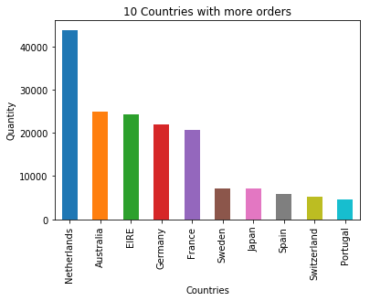

# Pandas Exercise

- [Jupyter Notebook 버전](./Pandas_Exercise.ipynb)

## 1. Load Packages

## 2. Import [DataSet](https://raw.githubusercontent.com/spb829/AI-Agent/practice3/Packages/Pandas/data.csv)


```python

```


<div>
<style scoped>
    .dataframe tbody tr th:only-of-type {
        vertical-align: middle;
    }

    .dataframe tbody tr th {
        vertical-align: top;
    }

    .dataframe thead th {
        text-align: right;
    }
</style>
<table border="1" class="dataframe">
  <thead>
    <tr style="text-align: right;">
      <th></th>
      <th>InvoiceNo</th>
      <th>StockCode</th>
      <th>Description</th>
      <th>Quantity</th>
      <th>InvoiceDate</th>
      <th>UnitPrice</th>
      <th>CustomerID</th>
      <th>Country</th>
    </tr>
  </thead>
  <tbody>
    <tr>
      <th>0</th>
      <td>536365</td>
      <td>85123A</td>
      <td>WHITE HANGING HEART T-LIGHT HOLDER</td>
      <td>6</td>
      <td>12/1/10 8:26</td>
      <td>2.55</td>
      <td>17850.0</td>
      <td>United Kingdom</td>
    </tr>
    <tr>
      <th>1</th>
      <td>536365</td>
      <td>71053</td>
      <td>WHITE METAL LANTERN</td>
      <td>6</td>
      <td>12/1/10 8:26</td>
      <td>3.39</td>
      <td>17850.0</td>
      <td>United Kingdom</td>
    </tr>
    <tr>
      <th>2</th>
      <td>536365</td>
      <td>84406B</td>
      <td>CREAM CUPID HEARTS COAT HANGER</td>
      <td>8</td>
      <td>12/1/10 8:26</td>
      <td>2.75</td>
      <td>17850.0</td>
      <td>United Kingdom</td>
    </tr>
    <tr>
      <th>3</th>
      <td>536365</td>
      <td>84029G</td>
      <td>KNITTED UNION FLAG HOT WATER BOTTLE</td>
      <td>6</td>
      <td>12/1/10 8:26</td>
      <td>3.39</td>
      <td>17850.0</td>
      <td>United Kingdom</td>
    </tr>
    <tr>
      <th>4</th>
      <td>536365</td>
      <td>84029E</td>
      <td>RED WOOLLY HOTTIE WHITE HEART.</td>
      <td>6</td>
      <td>12/1/10 8:26</td>
      <td>3.39</td>
      <td>17850.0</td>
      <td>United Kingdom</td>
    </tr>
  </tbody>
</table>
</div>


## 3. Create a bar graph with the 10 countries that have the most 'Quantity' ordered except UK


```python
# group by the Country


# sort the value and get the first 10 after UK


# create the plot


# Set the title and labels


# show the plot

```




