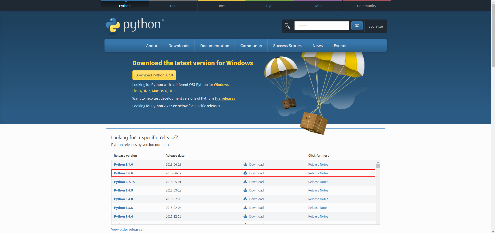
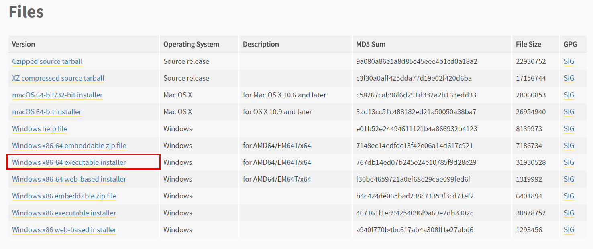
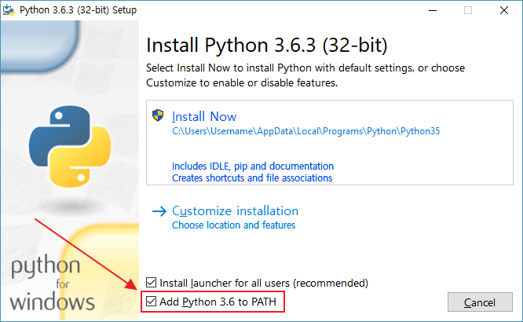
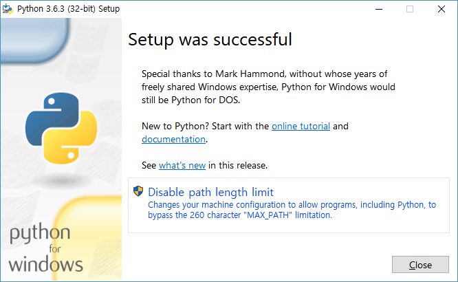
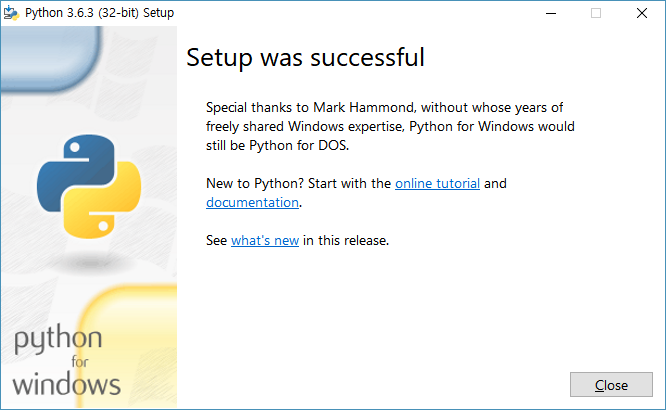

# Python - Windows 설치
파이썬 3.6 설치

## Python3 다운로드 및 설치

- [파이썬 공식 다운로드 사이트](https://www.python.org/downloads/) 접속
- [Python 3.6.x 버전 선택](https://www.python.org/downloads/release/python-366/)



- 64bit용 설치파일 [다운로드](https://www.python.org/ftp/python/3.6.6/python-3.6.6-amd64.exe)



- "Install Python 3.x.x (32-bit)" --- Add Python 3.x to PATH 체크
- Install Now 버튼을 눌러 설치를 시작한다.



- Disable path length limit 클릭



- Close버튼 클릭



## 설치 확인

- Win + R -> cmd를 통해 Python 버전 확인
```shell
C:\Users\user>python -V
Python 3.6.6
```